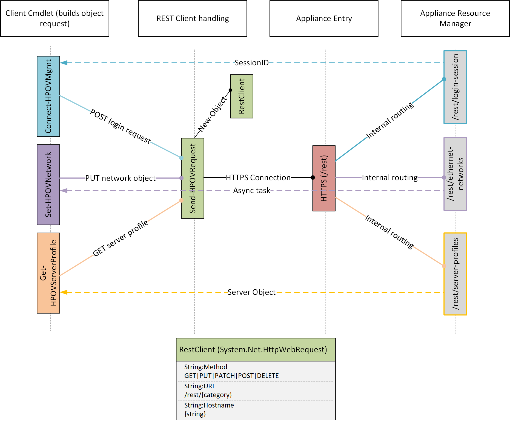

# Introduction

## Introduction

HPE OneView makes it simple to deploy and manage today’s complex hybrid cloud infrastructure. HPE OneView can help you transform your data center to software-defined, and it supports HPE’s broad portfolio of servers, storage, and networking solutions, ensuring the simple and automated management of your hybrid infrastructure. Software-defined intelligence enables a template-driven approach for deploying, provisioning, updating, and integrating compute, storage, and networking infrastructure.

This library enables PowerShell developers, IT automation engineers, or devops teams the ability to utilize HPE OneView's open REST API to automate infrastructure policies and operations. Starting with the HPE OneView 5.00 PowerShell library, PowerShell Core is now supported.

This PowerShell module requires the following minimum versions:

### **Table 1. Requirements**




| Component | Version |
| :--- | :--- |
| .NetStandard | 2.0 or newer |
| PowerShell | 7.0 or newer |
| PowerShellCore | 7.0 or newer |
| HPE OneView/HPE Synergy | 9.10 or newer |


.NetStandard 2.0 API's are supported by both the [.NetFramework 4.7.2 Windows](https://devblogs.microsoft.com/dotnet/announcing-the-net-framework-4-7-2/) and [DotNetCore 2.0](https://devblogs.microsoft.com/dotnet/announcing-net-core-2-0/) clients.




| Component | Version |
| :--- | :--- |
| .NetStandard | 2.0 or newer |
| PowerShell | 7.0 or newer |
| PowerShellCore | 7.0 or newer |
| HPE OneView/HPE Synergy | 8.60 or newer |


.NetStandard 2.0 API's are supported by both the [.NetFramework 4.7.2 Windows](https://devblogs.microsoft.com/dotnet/announcing-the-net-framework-4-7-2/) and [DotNetCore 2.0](https://devblogs.microsoft.com/dotnet/announcing-net-core-2-0/) clients.




| Component | Version |
| :--- | :--- |
| .NetStandard | 2.0 or newer |
| PowerShell | 7.0 or newer |
| PowerShellCore | 7.0 or newer |
| HPE OneView/HPE Synergy | 8.40 or newer |


.NetStandard 2.0 API's are supported by both the [.NetFramework 4.7.2 Windows](https://devblogs.microsoft.com/dotnet/announcing-the-net-framework-4-7-2/) and [DotNetCore 2.0](https://devblogs.microsoft.com/dotnet/announcing-net-core-2-0/) clients.




| Component | Version |
| :--- | :--- |
| .NetStandard | 2.0 or newer |
| PowerShell | 7.0 or newer |
| PowerShellCore | 7.0 or newer |
| HPE OneView/HPE Synergy | 8.30 or newer |


.NetStandard 2.0 API's are supported by both the [.NetFramework 4.7.2 Windows](https://devblogs.microsoft.com/dotnet/announcing-the-net-framework-4-7-2/) and [DotNetCore 2.0](https://devblogs.microsoft.com/dotnet/announcing-net-core-2-0/) clients.




| Component | Version |
| :--- | :--- |
| .NetStandard | 2.0 or newer |
| PowerShell | 7.0 or newer |
| PowerShellCore | 7.0 or newer |
| HPE OneView/HPE Synergy | 8.00 or newer |


.NetStandard 2.0 API's are supported by both the [.NetFramework 4.7.2 Windows](https://devblogs.microsoft.com/dotnet/announcing-the-net-framework-4-7-2/) and [DotNetCore 2.0](https://devblogs.microsoft.com/dotnet/announcing-net-core-2-0/) clients.




| Component | Version |
| :--- | :--- |
| .NetStandard | 2.0 or newer |
| PowerShell | 5.1, 7.0 or newer |
| PowerShellCore | 7.0 or newer |
| HPE OneView/HPE Synergy | 7.20 or newer |


.NetStandard 2.0 API's are supported by both the [.NetFramework 4.7.2 Windows](https://devblogs.microsoft.com/dotnet/announcing-the-net-framework-4-7-2/) and [DotNetCore 2.0](https://devblogs.microsoft.com/dotnet/announcing-net-core-2-0/) clients.




| Component | Version |
| :--- | :--- |
| .NetStandard | 2.0 or newer |
| PowerShell | 5.1, 7.0 or newer |
| PowerShellCore | 7.0 or newer |
| HPE OneView/HPE Synergy | 7.10 or newer |


.NetStandard 2.0 API's are supported by both the [.NetFramework 4.7.2 Windows](https://devblogs.microsoft.com/dotnet/announcing-the-net-framework-4-7-2/) and [DotNetCore 2.0](https://devblogs.microsoft.com/dotnet/announcing-net-core-2-0/) clients.




| Component | Version |
| :--- | :--- |
| .NetStandard | 2.0 or newer |
| PowerShell | 5.1, 7.0 or newer |
| PowerShellCore | 7.0 or newer |
| HPE OneView/HPE Synergy | 7.00 or newer |


.NetStandard 2.0 API's are supported by both the [.NetFramework 4.7.2 Windows](https://devblogs.microsoft.com/dotnet/announcing-the-net-framework-4-7-2/) and [DotNetCore 2.0](https://devblogs.microsoft.com/dotnet/announcing-net-core-2-0/) clients.




| Component | Version |
| :--- | :--- |
| .NetStandard | 2.0 or newer |
| PowerShell | 5.1, 7.0 or newer |
| PowerShellCore | 7.0 or newer |
| HPE OneView/HPE Synergy | 6.60 or newer |


.NetStandard 2.0 API's are supported by both the [.NetFramework 4.7.2 Windows](https://devblogs.microsoft.com/dotnet/announcing-the-net-framework-4-7-2/) and [DotNetCore 2.0](https://devblogs.microsoft.com/dotnet/announcing-net-core-2-0/) clients.





### **Table 2. Deprecated releases**

The following table documents which versions of the HPE OneView PowerShell libraries are no longer supported.  It is advised administrators update to a supported library release.

| Library | Components | Version |
| :--- | :--- | :--- |
| HPE OneView 6.30 | .NetStandard | 2.0 or newer |
| HPE OneView 6.30 | PowerShell | 5.1 or 6.0 |
| HPE OneView 6.30 | PowerShellCore | 7.0 or newer |
| HPE OneView 6.30 | HPE OneView/HPE Synergy | 5.60 or newer |
| HPE OneView 6.20 | .NetStandard | 2.0 or newer |
| HPE OneView 6.20 | PowerShell | 5.1 or 6.0 |
| HPE OneView 6.20 | PowerShellCore | 7.0 or newer |
| HPE OneView 6.20 | HPE OneView/HPE Synergy | 5.60 or newer |
| HPE OneView 6.10 | .NetStandard | 2.0 or newer |
| HPE OneView 6.10 | PowerShell | 5.1 or 6.0 |
| HPE OneView 6.10 | PowerShellCore | 7.0 or newer |
| HPE OneView 6.10 | HPE OneView/HPE Synergy | 5.60 or newer |
| HPE OneView 6.00 | .NetStandard | 2.0 or newer |
| HPE OneView 6.00 | PowerShell | 5.1 or 6.0 |
| HPE OneView 6.00 | PowerShellCore | 7.0 or newer |
| HPE OneView 6.00 | HPE OneView/HPE Synergy | 5.60 or newer |
| HPE OneView 5.60 | .NetStandard | 2.0 or newer |
| HPE OneView 5.60 | PowerShell | 5.1 or 6.0 |
| HPE OneView 5.60 | PowerShellCore | 7.0 or newer |
| HPE OneView 5.60 | HPE OneView/HPE Synergy | 5.60 or newer |
| HPE OneView 5.40 | .NetStandard | 2.0 or newer |
| HPE OneView 5.40 | PowerShell | 5.1 or 6.0 |
| HPE OneView 5.40 | PowerShellCore | 7.0 or newer |
| HPE OneView 5.40 | HPE OneView/HPE Synergy | 5.40 or newer |
| HPE OneView 5.30 | .NetStandard | 2.0 or newer |
| HPE OneView 5.30 | PowerShell | 5.1 or 6.0 |
| HPE OneView 5.30 | PowerShellCore | 7.0 or newer |
| HPE OneView 5.30 | HPE OneView/HPE Synergy | 5.30 or newer |
| HPE OneView 5.20 | .NetStandard | 2.0 or newer |
| HPE OneView 5.20 | PowerShell | 5.1 or 6.0 |
| HPE OneView 5.20 | PowerShellCore | 7.0 or newer |
| HPE OneView 5.20 | HPE OneView/HPE Synergy | 5.20 or newer |
| HPE OneView 5.00 | .NetStandard | 2.0 or newer |
| HPE OneView 5.00 | PowerShell | 5.1 or 6.0 |
| HPE OneView 5.00 | PowerShellCore | 7.0 or newer |
| HPE OneView 5.00 | HPE OneView/HPE Synergy | 5.00 or newer |
| HPE OneView 4.20 | Windows Management Framework \(WMF\) | 4.0 |
| HPE OneView 4.20 | .Net Client Framework | 4.6 |
| HPE OneView 4.20 | HPE OneView/HPE Synergy | 4.20 or newer |
| HPE OneView 4.10 | Windows Management Framework \(WMF\) | 4.0 |
| HPE OneView 4.10 | .Net Client Framework | 4.6 |
| HPE OneView 4.10 | HPE OneView/HPE Synergy | 4.20 or newer |
| HPE OneView 4.00 | Windows Management Framework \(WMF\) | 4.0 |
| HPE OneView 4.00 | .Net Client Framework | 4.6 |
| HPE OneView 4.00 | HPE OneView/HPE Synergy | 4.00 or newer |
| HPE OneView 3.10 | Windows Management Framework \(WMF\) | 4.0 |
| HPE OneView 3.10 | .Net Client Framework | 4.6 |
| HPE OneView 3.10 | HPE OneView/HPE Synergy | 3.10 or newer |
| HPE OneView 3.00 | Windows Management Framework \(WMF\) | 4.0 |
| HPE OneView 3.00 | .Net Client Framework | 4.6 |
| HPE OneView 3.00 | HPE OneView/HPE Synergy | 3.00 or newer |
| HPE OneView 2.00 | Windows Management Framework \(WMF\) | 4.0 |
| HPE OneView 2.00 | .Net Client Framework | 4.6 |
| HPE OneView 2.00 | HPE OneView | 2.00 or newer |
| HPE OneView 1.20 | Windows Management Framework \(WMF\) | 3.0 |
| HPE OneView 1.20 | .Net Client Framework | 4.0 |
| HPE OneView 1.20 | HPE OneView | 1.20 or newer |

## Installer changes

Starting with the HPE OneView 5.00 PowerShell library, the provided EXE installer is no longer available. The library has been published to the Microsoft PowerShell Gallery since the release of the 3.10 library. To install the library on another system that might not have Internet access, please review the [`Save-Module`](https://go.microsoft.com/fwlink/?LinkId=531351) PowerShellGet Cmdlet.

### How to obtain and install the 4.20 or older library

The library can be installed in one of two ways:

* Starting with the HPE OneView 3.10 library release, it is now published on the PowerShellGallery.  `Install-Module HPEOneView.{VERSION}` or `Save-Module HPEOneView.{VERSION}` can be used for those using PowerShell 5.0 or newer \(with the [PowerShellGet module](https://github.com/powerShell/powershellget)\).
* Go to the Code then [Releases](https://github.com/HewlettPackard/POSH-HPOneView/releases) tab in this repository, and download the current release for the version you wish to download.

### Importing the library into your PowerShell console

The library module name to import is always `HPEOneView.{VERSION}`, where `{VERSION}` is the `Major` and `Minor` version concatenated together. For example, to load the HPE OneView 9.10 library, issue the following command within your PowerShell console:

```text
Import-Module HPEOneView.910
```


You may need to include the `-AllowClobber` parameter when using `Install-Module`, when you intend to install more than 1 module on your system.


### How to start using the library

There are 5 primary CMDLETs to interact with the HPE OneView appliance:

* Connect-OVMgmt
* Send-OVRequest
* New-OVResource
* Set-OVResource
* Remove-OVResource


Cmdlet suffix names changed starting with the HPE OneView 5.30 release, and removed the HP part of the suffix which was `HPOV`.


New in the HPE OneView 2.00 library is the ability to connect to multiple appliances, which allows the user to execute various CMDLETs without requiring to disconnect and reconnect to other appliances within your PowerShell session. The `Connect-OVMgmt` CMDLET will authenticate you to the requested appliance. From there, a session object \(Type `[HPEOneView.Appliance.Connection]`\) is created and added to a global variable `$ConnectedSessions` \(Type `[System.Collections.ArrayList]`\) in your PowerShell runtime environment that other CMDLETs will use. Within the `[HPEOneView.Appliance.Connection]` object contains a number of properties, of which the connected appliance `hostname` value provided by `Connect-OVMgmt` is stored, along with the `SessionID` of your user session.


For more information about multiple appliance connection support, please review `get-help about_Appliance_Connections` from your PowerShell console, or read the online wiki page for [about\_Appliance\_Connections](about/about_appliance_connections.md).


The [`New-OVResource`](), [`Set-OVRequest`]() and [`Remove-OVResource`]() Cmdlets are mainly for callers to perform Create, Update and Delete operations where a native Cmdlet hasn't been developed. The following diagram is an example of flow, where [`Send-OVRequest`]() is the main Cmdlet that directly communicates with the HPE OneView REST API.



Once completed, you can either close out of your PowerShell console, or issue the [`Disconnect-OVMgmt`]() CMDLET to terminate your session, and return you back to your PowerShell consoles prior state.

### Sample Scripts

To ease the use of the HPE OneView PowerShell library, we have included a number of sample scripts administrators can use to quickly get familiar with the capabilities of the library. The sample scripts are part of the source code and installer. Depending on which installation scope you chose, a Samples directory contains all of the sample scripts. By no means are they exhaustive, but will help you get more familiar with the library.

```text
[PS] ...\Samples> dir
    Directory: \HPEOneView.720\Samples


Mode                 LastWriteTime         Length Name
----                 -------------         ------ ----
la---          10/24/2022  2:37 PM           4166 AddServers_Monitored_Sample.ps1
la---          10/24/2022  2:37 PM           5059 AddStorageSystem_Sample.ps1
la---          10/24/2022  2:38 PM           3734 Alerts_Sample.ps1
la---          10/24/2022  2:38 PM           2951 Appliance_Backup_Sample.ps1
la---          10/24/2022  2:38 PM          18388 ApplianceConfig_Sample.ps1
la---          10/24/2022  2:34 PM          13380 ComposerApplianceConfig_Sample.ps1
la---            2/2/2022  9:11 AM          10035 Configure_IIS_WebDav_ExternalRepo_Sample.ps1
la---          10/24/2022  2:38 PM           8787 ConfigureRemoteSupport_Sample.ps1
la---          10/24/2022  2:38 PM           3632 CreateEnclosureGroup_Sample.ps1
la---          10/24/2022  2:38 PM           3510 DefineLogicalInterconnectGroup_AA_VC_Sample.ps1
la---          10/24/2022  2:38 PM           3404 DefineLogicalInterconnectGroup_Sample.ps1
la---          10/24/2022  2:38 PM           3371 DefineNetworks_AA_VC_Sample.ps1
la---          10/24/2022  2:38 PM           3639 DefineNetworks_Sample.ps1
la---          10/24/2022  2:38 PM           7010 Server_Multiconnection_AA_VC_Sample.ps1
la---           4/27/2022  2:23 PM           7344 Server_Multiconnection_Sample.ps1
la---           4/27/2022  2:23 PM           7770 Server_Multiconnection_SAN_Storage_Sample.ps1
la---          10/24/2022  2:38 PM           5697 Server_Profile_Template_Multiconnection_Sample.ps1
la---           8/23/2022  7:27 PM           4395 Server_Profile_Template_Rack_Server_Sample.ps1
la---           4/27/2022  2:23 PM           8014 Wipe_Appliance.ps1
```

### Generating sample code

Introduced in the HPE OneView 4.10 library, the [`ConvertTo-OVPowerShellScript`](/cmdlets/v6.60/library/convertto-ovpowershellscript) Cmdlet will take supported resources that were created either with the UI or other REST API client or HPE OneView SDK's, and generate PowrShell script code.

Here is an example of generating PowerShell script code from an HPE Synergy server profile created in the UI:


```text
# Get the profile and generate PowerShell script code
Get-OVServerProfile -Name prf1 | ConvertTo-OVPowerShellScript

# -------------- Attributes for ServerProfile "prf1"
$name                       = "prf1"
$description                = "prf1"
$server                     = Get-OVServer -Name "Encl-1, bay 11"
$affinity                   = "Bay"
# -------------- Attributes for connection "1"
$connID                     = 1
$connType                   = "Ethernet"
$netName                    = "Mgmt"
$ThisNetwork                = Get-OVNetwork -Type Ethernet -Name $netName
$portID                     = "Mezz 3:1-a"
$requestedMbps              = 2500
$Conn1                      = New-OVServerProfileConnection -ConnectionID $connID -ConnectionType $connType -Network $ThisNetwork -PortId $portID -RequestedBW $requestedMbps
# -------------- Attributes for connection "2"
$connID                     = 2
$connType                   = "Ethernet"
$netName                    = "Mgmt"
$ThisNetwork                = Get-OVNetwork -Type Ethernet -Name $netName
$portID                     = "Mezz 3:2-a"
$requestedMbps              = 2500
$Conn2                      = New-OVServerProfileConnection -ConnectionID $connID -ConnectionType $connType -Network $ThisNetwork -PortId $portID -RequestedBW $requestedMbps
$connections                = $Conn1, $Conn2
# -------------- Attributes for logical disk "Boot(RAID1)"
$ldName                     = "Boot"
$raidLevel                  = "RAID1"
$numPhysDrives              = 2
$driveTech                  = "Auto"
$LogicalDisk1               = New-OVServerProfileLogicalDisk -Name $ldName -Raid $raidLevel -NumberofDrives $numPhysDrives -DriveType $driveTech -Bootable $True
# -------------- Attributes for controller "Embedded" (Mixed)
$deviceSlot                 = "Embedded"
$controllerMode             = "Mixed"
$LogicalDisks               = $LogicalDisk1
$writeCache                 = "Enabled"
$controller1                = New-OVServerProfileLogicalDiskController -ControllerID $deviceSlot -Mode $controllerMode -WriteCache $writeCache -LogicalDisk $LogicalDisks
$controllers                = $controller1
# -------------- Attributes for BIOS Boot Mode settings
$manageboot                 = $True
$biosBootMode               = "UEFIOptimized"
# -------------- Attributes for BIOS order settings
$bootOrder                  = "HardDisk"
# -------------- Attributes for BIOS settings
$biosSettings               = @(
        @{id = 'WorkloadProfile'; value = 'GeneralThroughputCompute'},
        @{id = 'PowerRegulator'; value = 'StaticHighPerf'},
        @{id = 'EnergyPerfBias'; value = 'MaxPerf'},
        @{id = 'CollabPowerControl'; value = 'Disabled'},
        @{id = 'NumaGroupSizeOpt'; value = 'Clustered'},
        @{id = 'SubNumaClustering'; value = 'Enabled'},
        @{id = 'EnergyEfficientTurbo'; value = 'Disabled'},
        @{id = 'IntelUpiPowerManagement'; value = 'Disabled'}
)
# -------------- Attributes for advanced settings
New-OVServerProfile -Name $name -Description $description -AssignmentType Server -Server $server -Affinity $affinity -Connections $connections -LocalStorage -StorageController $controllers -ManageBoot:$manageboot -BootMode $biosBootMode -BootOrder $bootOrder -Bios -BiosSettings $biosSettings -HideUnusedFlexNics $true
```

#### HPE OneView automation sample repository

We have created a home for contributors to provide sample scripts or automation toolkits that use various HPE OneView ecosystem providers. You can find those samples on the [HPE OneView Samples GitHub project repository](https://github.com/hewlettPackard/oneview-samples).

Others have contributed example scripts to further automate management within the infrastructure. Please use the following links to see other examples not included within the library Samples directory.

* [HPE OneView PowerShell samples](https://github.com/HewlettPackard/oneview-powershell-samples/tree/master)
* [Rename-LANNetwork](https://github.com/HewlettPackard/oneview-powershell-samples/tree/master/Networking/Rename-LANNetworks)
* [Import/Export-OVResources](https://github.com/DungKHoang/Import-Export-OneView-Resources)
* [Automate Appliance Backup](https://github.com/HewlettPackard/oneview-powershell-samples/tree/master/Appliance/Automate-Appliance-Backup)
* [Configure iLO settings from OneView using iLO RedFish Cmdlets](https://github.com/HewlettPackard/oneview-powershell-samples/tree/master/Server%20Hardware/Creator-iLO)

### Additional Resources

#### **HPE OneView Python Library**

* [HPE OneView Python library source code, updates and issues tracker](https://github.com/HewlettPackard/oneview-python)

**HPE OneView Documentation on the HPE Enterprise Information Library**

* [HPE OneView User Guide for HPE Synergy](https://www.hpe.com/support/oneview-guide-synergy)
* [HPE OneView User Guide for VMs](https://www.hpe.com/support/oneview-guide-vms)
* [HPE OneView Installation Guide](https://www.hpe.com/support/OneView-IG)
* [HPE OneView Support Matrix for HPE Synergy](https://www.hpe.com/support/OneView-Synergy-SM)
* [HPE OneView Support Matrix](https://www.hpe.com/support/OneView-SM)
* [HPE OneView Release Notes for HPE Synergy](https://www.hpe.com/support/OneView-Synergy-RN)
* [HPE OneView Release Notes](https://www.hpe.com/support/OneView-RN)
* [HPE OneView Best Practices Guide for Deployment and Management](https://www.hpe.com/support/OV-deploy-manage-guide)
* [HPE OneView API Reference Quick Links](https://www.hpe.com/support/OV-API-reference)
* [HPE OneView Alerts User Guide for HPE Synergy](https://www.hpe.com/support/Alerts-Guide-Synergy)
* [HPE OneView Alerts User Guide for VMs](https://www.hpe.com/support/Alerts-Guide-VMs)

**HPE OneView Community**

* [HPE OneView Community Forums](http://hpe.com/info/oneviewcommunity)

Learn more about HPE OneView at [hpe.com/info/oneview](http://hpe.com/info/oneview)

